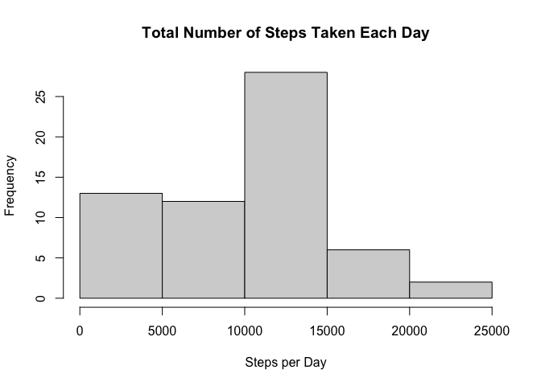
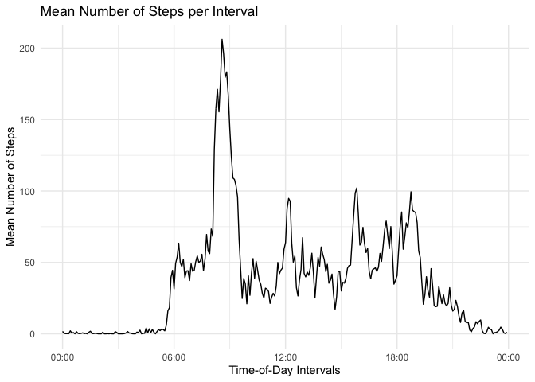
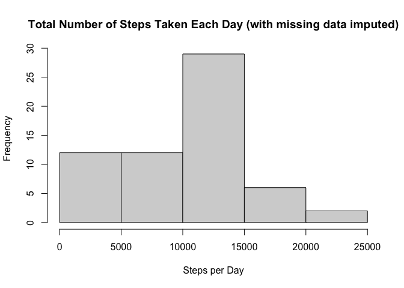
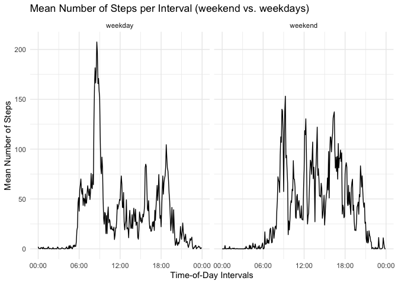

## Loading and preprocessing the data
Data is loaded, and assigned to the variable `data`.


```r
url = 'https://d396qusza40orc.cloudfront.net/repdata%2Fdata%2Factivity.zip'
if (!file.exists("./data.zip")){
  download.file(url,'./data.zip', mode = 'wb')
  unzip("data.zip", exdir = getwd())
}

data <- read.csv("activity.csv")
```


## What is mean total number of steps taken per day?
Calculate the total number of steps per day, and create a histogram. 


```r
steps_day <- data %>% group_by(date) %>% summarise(stepsperday = sum(steps, na.rm=TRUE))
hist(steps_day$stepsperday, xlab = "Steps per Day", main = "Total Number of Steps Taken Each Day")
```

<!-- -->

Calculate the mean and median number of steps per day.


```r
mean_steps_each_day = as.integer(mean(steps_day$stepsperday))
median_steps_each_day = median(steps_day$stepsperday)
```

The mean number of steps taken each day is: 9354.
The median number of steps taken each day is 10395.


## What is the average daily activity pattern?

Create a time series plot of the number of steps taken.


```r
#convert intervals to a four digit string by left padding with zeros
data$interval <- str_pad(data$interval, 4, side="left", pad="0")

#convert the interval strings to actual time objects
data$interval <- parse_date_time(data$interval, orders = "HM")

#find the mean number of steps per interval across all days
steps_by_interval <- data %>% group_by(interval) %>% summarise(stepsperinterval = mean(steps, na.rm = TRUE))

#create a plot
ggplot(steps_by_interval, aes(x=interval, y=stepsperinterval)) + geom_line() + scale_x_datetime(date_labels = "%H:%M") + xlab("Time-of-Day Intervals") +ylab("Mean Number of Steps") + ggtitle("Mean Number of Steps per Interval") + theme_minimal()
```

<!-- -->

```r
max_average_interval <- as.character(steps_by_interval[which.max(steps_by_interval$stepsperinterval),1]$interval)
max_average_interval <- substr(max_average_interval, 12, 16)
```

The 5-minute interval which contains on average the highest number of steps is 08:35.

## Imputing missing values


```r
# Calculate and report the total number of missing values in the dataset (i.e. the total number of rows with NAs)
rows_with_missing_values <- sum(is.na(data$steps))

# Create a new dataset that is equal to the original dataset but with the missing data filled in.
imputed_data <- data
for (i in 1:dim(imputed_data)[1]) {
  if (is.na(imputed_data[i,"steps"])) {
    if (!is.na(steps_by_interval[i,"stepsperinterval"])) {
      imputed_data[i,"steps"] = steps_by_interval[i,"stepsperinterval"]
      } else {
        imputed_data[i,"steps"] = 0
      }
  }
}
```

The total number of rows with missing values (NAs) is 2304.

### Strategy for filling in missing values

In general, missing values will be replaced with the average number of steps for that particular interval across all days. In any cases where the number of steps for a particular interval is missing from all days, it will be replaced with zero.

The following histogram shows the total number of steps taken each day including imputed missing values.


```r
#Make a histogram of the total number of steps taken each day.
steps_day <- imputed_data %>% group_by(date) %>% summarise(stepsperday = sum(steps, na.rm=TRUE))
hist(steps_day$stepsperday, xlab = "Steps per Day", main = "Total Number of Steps Taken Each Day (with missing data imputed)")
```

<!-- -->

Calculate and report the mean and median number of steps taken each day (using imputed missing values).


```r
imputed_mean_steps_each_day = as.integer(mean(steps_day$stepsperday))
imputed_median_steps_each_day = as.integer(median(steps_day$stepsperday))
```

The mean number of steps taken each day with imputed missing values is: 9530. The value originally calculated was 9354.

The median number of steps taken each day with imputed missing values is 10439. The value originally calculated was 10395.

There is a difference between the original values and the values using imputed missing data - including imputed missing data increases the mean and median numbers.

## Are there differences in activity patterns between weekdays and weekends?


```r
# Create a new factor variable in the dataset with two levels – “weekday” and “weekend” indicating whether a given date is a weekday or weekend day.
imputed_data$day <- factor("weekday", "weekend")
weekday <- function(x) {
  if(weekdays(x) %in% c("Monday", "Tuesday", "Wednesday", "Thursday", "Friday")) {
    return("weekday")
  } else {
    return("weekend")
  }
}
imputed_data$day <- sapply(as.Date(imputed_data$date), weekday)
steps_by_interval <- imputed_data %>% group_by(day, interval) %>% summarise(stepsperinterval = mean(steps))

# Make a panel plot containing a time series plot (i.e. type = "l") of the 5-minute interval (x-axis) and the average number of steps taken, averaged across all weekday days or weekend days (y-axis). 
ggplot(steps_by_interval, aes(x=interval, y=stepsperinterval)) + scale_x_datetime(date_labels = "%H:%M") + xlab("Time-of-Day Intervals") +ylab("Mean Number of Steps") + ggtitle("Mean Number of Steps per Interval (weekend vs. weekdays)") + theme_minimal() + geom_line() + facet_grid(.~day)
```

<!-- -->


